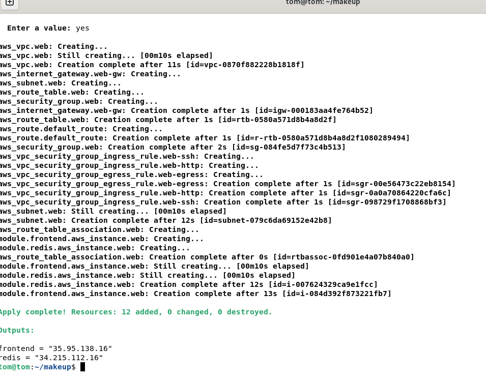

# makeuplab


This repository contains infrastructure managed with Terraform and server configuration managed with Ansible. Terraform provisions two EC2 instances on AWS: one Ubuntu server used as the frontend (nginx), and one Rocky Linux server used as the Redis backend (fake). Ansible then configures these servers using properly separated roles.

---

## Project Structure

```
.
├── terraform/
│   ├── main.tf
│   ├── provider.tf
│   └── modules/
│       └── web-server/
│           ├── main.tf
│           ├── outputs.tf
│           └── variables.tf
└── ansible/
    ├── ansible.cfg
    ├── playbook.yml
    ├── inventory/
    │   └── aws_ec2.yml
    └── roles/
        ├── frontend/
        │   ├── tasks/main.yml
        │   └── handlers/main.yml
        └── redis/
            ├── tasks/main.yml
            └── handlers/main.yml
```

---

## How the Playbook Works

The `playbook.yml` file is the main entry point for Ansible. It targets all servers discovered by the AWS EC2 dynamic inventory plugin. Each EC2 instance includes a tag that determines its role (`server_role_Web` or `server_role_Database`). Based on these tags, the appropriate role is executed.

- The **frontend** role installs nginx on Ubuntu, deploys an `index.html` template and nginx configuration, and uses handlers to reload nginx whenever configuration files change.

- The **redis** role installs nginx on Rocky Linux using the dnf package manager.

The playbook structure ensures that each server only receives the configuration relevant to its assigned role.

---

## How the Roles Work

### frontend role

Located in `roles/frontend/`.

This role contains:
- `tasks/main.yml`: installs nginx, deploys templates, deploys nginx configs, ensures symlinks.
- `handlers/main.yml`: reloads nginx whenever a file or template updates.

The handler system ensures nginx reloads only when required.

### redis role

Located in `roles/redis/`.

This role contains:
- `tasks/main.yml`: installs the Redis package on Rocky Linux.


---

## Setup Instructions

### 1. Clone the repository

```bash
git clone <repo-url>
cd makeuplab
```

### 2. Create a new AWS SSH key

```bash
ssh-keygen -f ~/.ssh/aws -N ""
```

### 3. Import the SSH key into AWS

```bash
./importkey ~/.ssh/aws.pub
```

### 4. Deploy infrastructure with Terraform

```bash
terraform init
terraform apply -auto-approve
```

After completion, Terraform outputs the public IPs of both servers.

### 5. Run Ansible configuration

```bash
cd ./ansible
ansible-playbook playbook.yml
```

---

## Screenshot



---
